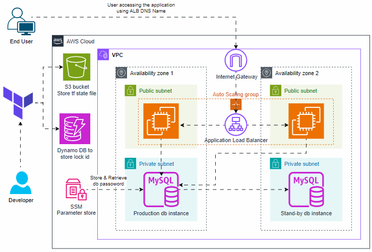

# Building a Scalable 2-Tier Architecture in AWS with Terraform
This repository is dedicated to documenting my journey in the project, "Building a Scalable 2-Tier Architecture in AWS with Terraform".

## About The Project
In this project i'm able to create a Scalable 2-tier architecture in AWS using Terraform. Additionally i have hosted a containerized python application using docker in EC2 instance & setup the Terraform remote backend using S3 & Dynamo DB. 


## Architecture


## Pre-requisite

- Create an [AWS account](https://portal.aws.amazon.com/billing/signup#/start/email) and install & configure [AWS CLI](https://docs.aws.amazon.com/cli/latest/userguide/getting-started-install.html) using [AWS Access & Secret key](https://docs.aws.amazon.com/IAM/latest/UserGuide/id_root-user_manage_add-key.html)

- [Github](https://github.com/) account

- Install & configure [Terraform](https://developer.hashicorp.com/terraform/tutorials/aws-get-started/install-cli)

- Configure your AWS region, AWS Secret Key, and Database Passowrd in the [terraform.tfvars](https://github.com/naveend3v/aws_2_tier_architecture/blob/main/terraform.tfvars) file

- Create a S3 bucket using below AWS CLI Command & replace the S3 bucket name & region in the [providers.tf](https://github.com/naveend3v/aws_2_tier_architecture/blob/main/providers.tf?plain=1#L5) file.

    ```aws s3api create-bucket --bucket <your-bucket-name> --region <your-aws-region> --output json``` 

- Create a Dynamo DB using below AWS CLI Command & replace the DynamodDB Table name in the [providers.tf](https://github.com/naveend3v/aws_2_tier_architecture/blob/main/providers.tf?plain=1#L11) file.

    ```aws dynamodb create-table --region <your-aws-region> --table-name <your-table-name> --attribute-definitions AttributeName=LockID,AttributeType=S --key-schema AttributeName=LockID,KeyType=HASH --billing-mode PAY_PER_REQUEST --output json```

## Blog
- I have written a detailed guidelines in this blog 👇 Feel free to read & let me know if any changes / issues if you observed.
    - https://naveend3v.medium.com/building-a-scalable-2-tier-architecture-in-aws-with-terraform-58eb460bff01

## Get In Touch
- Twitter: https://twitter.com/naveend3v
- Linkedin: https://www.linkedin.com/in/naveend3v/
- Github: https://github.com/naveend3v
- Email: naveenselvaraj1997@gmail.com